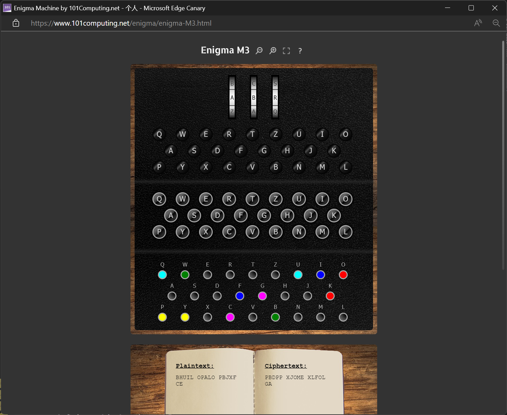
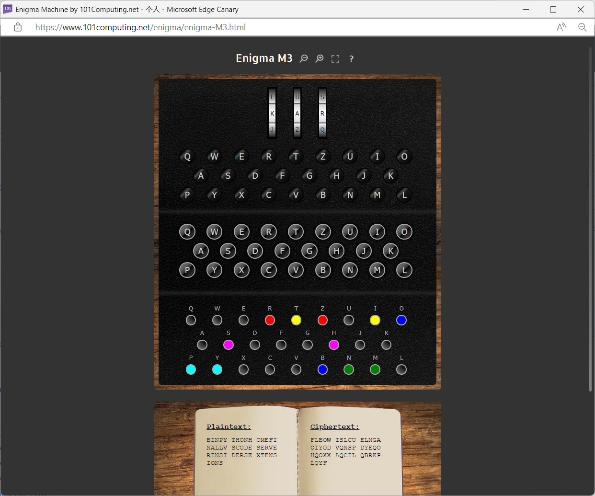

# 现代密码学 作业 1

## 一

使用了图灵方法。

### 原理

#### 寻找环

以 DFS 的形式寻找环。具体地，`find_ring` 函数的 `current` 参数代表现在寻找的目标。若在明（密）文中找到了 `current`，则查看密（明）文中同一位置字符 c：
- 若 c 在先前的查找中出现过，则找到了环；
- 否则令 current = c 递归查找。

#### 确定转子排列和初始位置

对于每种转子排列、每种初始位置，对于先前找到的每个环，对于每个字母，（通过模拟 Enigma 机）尝试这一字母通过环后是否保持不变。如果保持不变，检查它是否与先前发现的环开头字母一致。一般来说都不一致，那么认为插线板交换了这两个字母，如此将所有能通过此环的字母和对应的交换对记录下来。

然后，对每个交换对，尝试与先前的环中找到的交换对形成的插线板配置组合。具体地，例如，先前的配置为 [(A, B)]，而当前环发现了对 [(A, C)]，则这个插线板配置应该被排除。如此，在搜索中一直记录着一组可行的插线板配置，记录它们是为了初步排除以及后续的搜索。

若发现对某个环，任何字母都不能通过；或者搜索某个环后，所有插线板配置都因为冲突而被丢弃，则否决当前转子排列和初始位置。

对于题目中明密文，如此会得到约 1000 组转子排列和初始位置。

#### 确定插线板配置

以下假设已知接线板交换 6 对。

对于每组转子排列和初始位置，以及得到的部分插线板配置，直接遍历所有插线板配置密钥空间过大，应想办法缩小。假设已经得到插线板配置 [(P, Y), (K, O)]（这是正解的情况）：
- 初始化一个“排除字母集合” E 为所有在插线板配置中出现的字母：{P, Y, K, O}；
- 在明文中寻找出现在排除字母集合中的字母 e，获取其在当前配置下的加密结果 c：
  - 若 c 在 E 中，继续；
  - 若 c 不在 E 中，看密文对应位置的字母 r：
    - 若 c == r，我们现在知道，在当前配置是正解的前提下，c(r) 不应被插线板交换。将它加入 E；
    - 若 c != r，我们找到了当前配置是正解的前提下应有的一个插线板交换对 (c, r)。将 c, r 都加入 E，并尝试将 (c, r) 加入插线板。此时如果有冲突，由于所有插线板中的对都是当前配置是正解所必要的，所以当前配置不是正解，可以换一组初始插线板配置；
- 交换明文、密文（明文作为密文，密文作为明文），再次遍历；
- 重复，直到找不到 e。

经过上述过程，一方面可以增加已知的插线板对数，另一方面可以找出不应被插线板交换的字母。剩余的插线板交换对暴力枚举，以正解为例，经过上述过程，已知插线板交换对数由 2 变为 4，并且知道了有 15 个字母不应被交换，从而需要继续搜索的对数减少为 3000 个左右。

将枚举出的对和现有对合并为完整插线板配置，尝试解密，直到解密成功。

### 代码使用说明

按照例子在 [`config.txt`](enigma/config.txt) 中设置好转子、反射器内部接线、Ring Setting 和明密文，运行 [`enigma.py`](enigma/enigma.py) 即可。

代码主要结构：
- `class Enigma` 实现了对 `Enigma` 机的模拟；
- `find_rings()` 实现了寻找环；
- `try_order_pos()` 进行第一阶段寻找初始位置和转子排列的操作；
- `extend_plugboard()` 扩充插线板并查找排除字母集；
- `try_full()` 进行第二阶段确定插线板设置的操作；
- `main()` 分两阶段进行搜索。搜索使用 `asyncio` 并行完成，以提升速度。

### 实验结果

首先是题目给定的例子。在 `config.txt` 中设置好转子和反射器内部接线、Ring Setting 和明密文：
```
Reflector:
A-Y, B-R, C-U, D-H, E-Q, F-S, G-L, H-D, I-P, J-X, K-N, L-G, M-O, N-K, O-M, P-I, Q-E, R-B, S-F, T-Z, U-C, V-W, W-V, X-J, Y-A, Z-T
Rotor I:
A-E, B-K, C-M, D-F, E-L, F-G, G-D, H-Q, I-V, J-Z, K-N, L-T, M-O, N-W, O-Y, P-H, Q-X, R-U, S-S, T-P, U-A, V-I, W-B, X-R, Y-C, Z-J
Rotor II:
A-A, B-J, C-D, D-K, E-S, F-I, G-R, H-U, I-X, J-B, K-L, L-H, M-W, N-T, O-M, P-C, Q-Q, R-G, S-Z, T-N, U-P, V-Y, W-F, X-V, Y-O, Z-E
Rotor III:
A-B, B-D, C-F, D-H, E-J, F-L, G-C, H-P, I-R, J-T, K-X, L-V, M-Z, N-N, O-Y, P-E, Q-I, R-W, S-G, T-A, U-K, V-M, W-U, X-S, Y-Q, Z-O
Ring setting:
G-Y-E
Message:
BHUILOPALOPBJXFCE
Cryptotext:
PBDPPXJOMEXLFOLGA
```

程序输出如下：
```
转子顺序        初始位置        插线板设置
[1, 3, 2]       ['A', 'A', 'A'] [('F', 'I'), ('P', 'Y'), ('B', 'W'), ('K', 'O'), ('C', 'G'), ('Q', 'U')]
[1, 3, 2]       ['A', 'A', 'A'] [('F', 'I'), ('P', 'Y'), ('B', 'W'), ('K', 'O'), ('D', 'N'), ('T', 'U')]
[1, 3, 2]       ['A', 'A', 'A'] [('F', 'I'), ('P', 'Y'), ('B', 'W'), ('K', 'O'), ('D', 'T'), ('N', 'U')]
[1, 3, 2]       ['A', 'A', 'A'] [('F', 'I'), ('P', 'Y'), ('B', 'W'), ('K', 'O'), ('N', 'R'), ('Q', 'U')]
[1, 3, 2]       ['A', 'A', 'A'] [('F', 'I'), ('P', 'Y'), ('B', 'W'), ('K', 'O'), ('N', 'S'), ('Q', 'U')]
[1, 3, 2]       ['A', 'A', 'A'] [('F', 'I'), ('P', 'Y'), ('B', 'W'), ('K', 'O'), ('N', 'T'), ('Q', 'U')]
[1, 3, 2]       ['A', 'A', 'A'] [('F', 'I'), ('P', 'Y'), ('B', 'W'), ('K', 'O'), ('N', 'V'), ('Q', 'U')]
[1, 3, 2]       ['A', 'A', 'A'] [('F', 'I'), ('P', 'Y'), ('B', 'W'), ('K', 'O'), ('N', 'Z'), ('Q', 'U')]
[1, 3, 2]       ['A', 'A', 'A'] [('F', 'I'), ('P', 'Y'), ('B', 'W'), ('K', 'O'), ('Q', 'U'), ('R', 'S')]
[1, 3, 2]       ['A', 'A', 'A'] [('F', 'I'), ('P', 'Y'), ('B', 'W'), ('K', 'O'), ('Q', 'U'), ('R', 'T')]
[1, 3, 2]       ['A', 'A', 'A'] [('F', 'I'), ('P', 'Y'), ('B', 'W'), ('K', 'O'), ('Q', 'U'), ('R', 'V')]
[1, 3, 2]       ['A', 'A', 'A'] [('F', 'I'), ('P', 'Y'), ('B', 'W'), ('K', 'O'), ('Q', 'U'), ('R', 'Z')]
[1, 3, 2]       ['A', 'A', 'A'] [('F', 'I'), ('P', 'Y'), ('B', 'W'), ('K', 'O'), ('Q', 'U'), ('S', 'T')]
[1, 3, 2]       ['A', 'A', 'A'] [('F', 'I'), ('P', 'Y'), ('B', 'W'), ('K', 'O'), ('Q', 'U'), ('S', 'V')]
[1, 3, 2]       ['A', 'A', 'A'] [('F', 'I'), ('P', 'Y'), ('B', 'W'), ('K', 'O'), ('Q', 'U'), ('S', 'Z')]
[1, 3, 2]       ['A', 'A', 'A'] [('F', 'I'), ('P', 'Y'), ('B', 'W'), ('K', 'O'), ('Q', 'U'), ('T', 'V')]
[1, 3, 2]       ['A', 'A', 'A'] [('F', 'I'), ('P', 'Y'), ('B', 'W'), ('K', 'O'), ('Q', 'U'), ('T', 'Z')]
[1, 3, 2]       ['A', 'A', 'A'] [('F', 'I'), ('P', 'Y'), ('B', 'W'), ('K', 'O'), ('Q', 'U'), ('V', 'Z')]
```

可以看到得到多组解，除倒数第三个是给定解外，其他都不一样，不过它们也是正解。例如：



这应该是因为给定明密文不足以继续排除这些解。

另一个例子：




配置：
```
...省略反射器和转子接线...
Ring setting:
F-U-C
Message:
BINPYTHONHOMEFINALLVSCODESERVERINSIDERSEXTENSIONS
Cryptotext:
FLBOWISLCUELNGAOIYODVQNSPDYEQOHQOXXAQCILQBRKPLQYF
```

输出：
```
转子顺序        初始位置        插线板设置
[3, 2, 1]       ['K', 'Y', 'U'] [('P', 'Y'), ('H', 'S'), ('I', 'T'), ('R', 'Z'), ('B', 'O'), ('M', 'N')]
```

使用的明密文对较长、包含环较多，恰好成功筛选出了唯一解。

尝试中，也有遇到明密文对中根本没有环的情况，此时无法成功破解。

## 二

### 1.6

由于密钥空间和明（密）文空间都很小，直接遍历，代码见 [`1.6.py`](1.6.py)。

输出 0 和 13，所以 0 和 13 是所有的对合密钥。

### 1.7

首先实现基于辗转相除法的 `gcd()` 函数，然后通过简单的遍历实现欧拉函数，最后按照 $n = m\phi(m)$ 输出即可。代码见 [`1.7.py`](1.7.py)。

结果：
```
30: 240
100: 4000
1225: 1029000
```

### 1.21

#### a

密文：
```
EMGLOSUDCGDNCUSWYSFHNSFCYKDPUMLWGYICOXYSIPJCKQPKUGKMGOLICGINCGACKSNISACYKZSCKXECJCKSHYSXCGOIDPKZCNKSHICGIWYGKKGKGOLDSILKGOIUSIGLEDSPWZUGFZCCNDGYYSFUSZCNXEOJNCGYEOWEUPXEZGACGNFGLKNSACIGOIYCKXCJUCIUZCFZCCNDGYYSFEUEKUZCSOCFZCCNCIACZEJNCSHFZEJZEGMXCYHCJUMGKUCY
```

使用 [`char_freq.py`](1.21a/char_freq.py) 分析其中各字母的频率：
```
C: 0.14453125
G: 0.09375
S: 0.078125
K: 0.0703125
Y: 0.05859375
I: 0.05859375
U: 0.0546875
N: 0.05078125
Z: 0.05078125
E: 0.046875
O: 0.0390625
F: 0.03515625
D: 0.03125
L: 0.02734375
X: 0.02734375
J: 0.02734375
P: 0.0234375
M: 0.01953125
W: 0.01953125
H: 0.01953125
A: 0.01953125
Q: 0.00390625
0 : C
1 : GSK
2 : E
3 : MWHA
4 : Q
```

下 5 行是参照课本中给出的频率分组分类的结果。

C 的出现率压倒地高，认为密文中的 C 对应明文中的 E（下记为 C-E）。使用 [`single_table_substitude.py`](1.21a/single_table_substitude.py) 应用替换 C-E F-W（小写字母表示已被替换的字母）：
```
EMGLOSUDeGDNeUSWYSwHNSweYKDPUMLWGYIeOXYSIPJeKQPKUGKMGOLIeGINeGAeKSNISAeYKZSeKXEeJeKSHYSXeGOIDPKZeNKSHIeGIWYGKKGKGOLDSILKGOIUSIGLEDSPWZUGwZeeNDGYYSwUSZeNXEOJNeGYEOWEUPXEZGAeGNwGLKNSAeIGOIYeKXeJUeIUZewZeeNDGYYSwEUEKUZeSOewZeeNeIAeZEJNeSHwZEJZEGMXeYHeJUMGKUeY
```

得到的文本中，组合 wZeeN 出现了 3 次。Z 和 N 的出现率：Z: 0.05078125, N: 0.05078125。考虑概率在 0.04 ~ 0.07 的全部字母：HILNRS，猜测 Z 和 N 可能各对应它们中的一个。令 Z-H, N-L，产生了常见单词 wheel，因此认为这是正确的。应用替换 C-E F-W Z-H N-L：
```
EMGLOSUDeGDleUSWYSwHlSweYKDPUMLWGYIeOXYSIPJeKQPKUGKMGOLIeGIleGAeKSlISAeYKhSeKXEeJeKSHYSXeGOIDPKhelKSHIeGIWYGKKGKGOLDSILKGOIUSIGLEDSPWhUGwheelDGYYSwUShelXEOJleGYEOWEUPXEhGAeGlwGLKlSAeIGOIYeKXeJUeIUhewheelDGYYSwEUEKUheSOewheeleIAehEJleSHwhEJhEGMXeYHeJUMGKUeY
```

因为确定了 E, H，所以尝试找到 the 对应的密文。有两次 Uhe，Khe, She 各一次，猜测 U-T：
```
EMGLOStDeGDletSWYSwHlSweYKDPtMLWGYIeOXYSIPJeKQPKtGKMGOLIeGIleGAeKSlISAeYKhSeKXEeJeKSHYSXeGOIDPKhelKSHIeGIWYGKKGKGOLDSILKGOItSIGLEDSPWhtGwheelDGYYSwtShelXEOJleGYEOWEtPXEhGAeGlwGLKlSAeIGOIYeKXeJteIthewheelDGYYSwEtEKtheSOewheeleIAehEJleSHwhEJhEGMXeYHeJtMGKteY
```

注意到子串 theSOewheel，应是 theonewheel，猜测 S-O, O-N：
```
EMGL not DeGDle to WYowHloweYKDPtMLWGYIenXYoIPJeKQPKtGKMGnLIeGIleGAeKolIoAeYKhoeKXEeJeKoHYoXeGnIDPKhelKoHIeGIWYGKKGKGnLDoILKGnItoIGLEDoPWhtG wheel DGYYowtohelXEnJleGYEnWEtPXEhGAeGlwGLKloAeIGnIYeKXeJteI the wheel DGYYowEtEK the one wheel eIAehEJleoHwhEJhEGMXeYHeJtMGKteY
```

注意到子串 loweY，猜测 Y-R：
```
EMGL not DeGDle to WrowHlowerKDPtMLWGrIenXroIPJeKQPKtGKMGnLIeGIleGAeKolIoAerKhoeKXEeJeKoHroXeGnIDPKhelKoHIeGIWrGKKGKGnLDoILKGnItoIGLEDoPWhtG wheel DGrrowtohelXEnJleGrEnWEtPXEhGAeGlwGLKloAeIGnIreKXeJteI the wheel DGrrowEtEK the one wheel eIAehEJleoHwhEJhEGMXerHeJtMGKter
```

想办法猜测 G 是什么。G 出现率很高（0.09375），有子串 DGrrow（2次，还都在 wheel 后面，应该是个独立单词），采用 [`find_words.py`](1.21a/find_words.py) 看一下包含已替换字母的 2-3 字符串出现次数：
```
eG: 7
eK: 5
Gn: 5
Ae: 5
Gr: 4
Ie: 3
oI: 3
Kt: 3
Ko: 3
eJ: 3
oH: 3
Xe: 3
nI: 3
GnI: 3
eI: 3
hE: 3
2 次及以下略...
```

可以看到 eG, Gn, Gr 都出现较多。DGrrow 中 r 是辅音字母，猜测 G 是个元音，也就是 AIU 之一。相比 IU，A 在英文中出现率更高，ea, an, ar 也都常见，因此猜测 G-A。查找单词 \*arrow，常见的有 narrow, barrow, harrow；又发现有子串 DeGDle，只有 D-B 产生 be able，比较合理。补充猜测 G-A D-B：
```
EMaL not be able to WrowHlowerKbPtMLWarIenXroIPJeKQPKtaKManLIeaIleaAeKolIoAerKhoeKXEeJeKoHroXeanIbPKhelKoHIeaIWraKKaKanLboILKanItoIaLEboPWhta wheel barrow to helXEnJlearEnWEtPXEhaAealwaLKloAeIanIreKXeJteIthe wheel barrow EtEK the one wheel eIAehEJleoHwhEJhEaMXerHeJtMaKter
```

注意到子串 aKKaKa，K 应该是个辅音字母，其出现率 0.0703125，概率 0.06 - 0.09 组中没被使用的辅音字母只有 S，猜测 K-S：
```
EMaL not be able to WrowHlowersbPtMLWarIenXroIPJesQPstasManLIeaIleaAesolIoAershoesXEeJesoHroXeanIbPshelsoHIeaIWrass as anLboILsanItoIaLEboPWhta wheel barrow to helXEnJlearEnWEtPXEhaAealwaLsloAeIanIresXeJteIthe wheel barrow EtEs the one wheel eIAehEJleoHwhEJhEaMXerHeJtMaster
```

注意到子串 EtEs，应是 it is，猜测 E-I：
```
i MaL not be able to WrowHlowersbPtMLWarIenXroIPJesQPstasManLIeaIleaAesolIoAer shoes XieJesoHroXeanIbPshel soHIeaIWrass as anLboILsanItoIaLiboPWhta wheel barrow to helXinJlearinWitPXihaAealwaLsloAeIanIresXeJteIthe wheel barrow it is the one wheele IAehiJleoHwhiJhiaMXerHeJtMaster
```

刚才 K-S 形成了 assasa，应该是 ...rass as an...，猜测 Wrass 就是 grass，即 W-G：
```
i MaL not be able to grow HlowersbPtMLgarIenXroIPJesQPstasManLIeaIleaAesolIoAer shoes XieJesoHroXeanIbPshelsoHIeaI grass as anLboILsanItoIaLiboPghta wheel barrow to helXinJlearing it PXihaAealwaLsloAeIanIresXeJteI the wheel barrow it is the one wheel eIAehiJleoHwhiJhiaMXerHeJtMaster
```

Jlearing 应是 clearing，grow 后面跟着 Hlowers 所以是 flowers，猜测 J-C, H-F：
```
i MaL not be able to grow flowers bPtMLgarIenXroIPcesQPstasManLIeaIleaAesolIoAer shoes XiecesofroXeanIbPshelsofIeaI grass as anLboILsanItoIaLiboPghta wheel barrow tohelXin clearing it PXihaAealwaLsloAeIanIresXecteI the wheel barrow it is the one wheel eIAehicle of which iaMXerfectMaster
```

iaMXerfectMaster 像是 i am perfect master，猜测 M-M, X-P，没什么违和：
```
i maL not be able to grow flowers bPtmL garIen proIPcesQPstasmanLIeaIleaAesolIoAer shoes pieces of rope anIbPshelsofIeaI grass as anLboILsanItoIaLiboPght a wheel barrow to help in clearing it PpihaAealwaLsloAeIanI respect eI the wheel barrow it is the one wheeleIAehicle of which i am perfect master
```

garIen 应是 garden，也符合语境，那么 wheeleIAehicle 就是 wheeled vehicle；maL 应是 may。猜测 I-D, A-V, L-Y：
```
i may not be able to grow flowers bPt my garden prodPces QPstas many dead leaves old over shoes pieces of rope and bPshels of dead grass as anybodys and today i boPght a wheel barrow to help in clearing it Pp i have always loved and respected the wheel barrow it is the one wheeled vehicle of which i am perfect master
```

从 bPt Pp 等都可以看出 P-U。Qustas 不像是一整个单词，把 as 分开就是 just as。至此破解完毕，明文如下：
```
I may not be able to grow flowers, but my garden produces just as many dead leaves, old over shoes pieces of rope and bushels of dead grass as anybody's. And today I bought a wheel barrow to help in clearing it up. I have always loved and respected the wheel barrow. It is the one wheeled vehicle of which I am perfect master.
```

#### b

密文：
```
KCCPKBGUFDPHQTYAVINRRTMVGRKDNBVFDETDGILTXRGUDDKOTFMBPVGEGLTGCKQRACQCWDNAWCRXIZAKFTLEWRPTYCQKYVXCHKFTPONCQQRHJVAJUWETMCMSPKQDYHJVDAHCTRLSVSKCGCZQQDZXGSFRLSWCWSJTBHAFSIASPRJAHKJRJUMVGKMITZHFPDISPZLVLGWTFPLKKEBDPGCEBSHCTURWXBAFSPEZQNRWXCVYCGAONWDDKACKAWBBIKFTIOVKCGGHJVLNHIFFSQESVYCLACNVRWBBIREPBBVFEXOSCDYGZWPFDTKFQIYCWHJVLNHIQIBTKHJVNPIST
```

首先进行 Kasiski 测试（[`kasiski.py`](1.21b/kasiski.py)），寻找所有三字母子串，满足与开头的距离的最大公约数 > 1：
```
MVG: 2
DDK: 22
HCT: 2
AFS: 6
RWX: 2
VYC: 6
WBB: 3
BBI: 2
JVL: 6
LNH: 2
NHI: 3
```

于是针对 m = [2, 3, 6, 11, 22]，计算重合指数（[`chonghezhishu.py`](1.21b/chonghezhishu.py)）：
```
2 0.042862078041718765
3 0.05092956420390049
6 0.06304017619807094
11 0.04238379344052315
22 0.05043290043290043
```

综上，有足够证据认为密钥长度为 6。使用 [`veg_find_key.py`](1.21b/veg_find_key.py) 寻找密钥，具体地，使用课本中例题的方法，对 m = 6 下的所有被密钥中同一个值移位的子串，求其 Mg 值，若 > 0.05 则输出。结果如下：
```
密钥第 0 位
2 0.06463157894736841
密钥第 1 位
17 0.07021428571428572
密钥第 2 位
24 0.058732142857142865
密钥第 3 位
11 0.051232142857142844
15 0.0660357142857143
密钥第 4 位
19 0.05585714285714286
密钥第 5 位
14 0.07046428571428573
```

于是密钥很可能是 [2, 17, 24, 15, 19, 14]。尝试用此密钥解密：
```
ILEARNEDHOWTOCALCULATETHEAMOUNTOFPAPERNEEDEDFORAROOMWHENIWASATSCHOOLYOUMULTIPLYTHESQUAREFOOTAGEOFTHEWALLSBYTHECUBICCONTENTSOFTHEFLOORANDCEILINGCOMBINEDANDDOUBLEITYOUTHENALLOWHALFTHETOTALFOROPENINGSSUCHASWINDOWSANDDOORDTHENYOUALLOWTHEOTHERHALFFORMATCHINGTHEPATTERNTHENYOUDOUBLETHEWHOLETHINGAGAINTOGIVEAMARGINOFERRORANDTHENYOUORDERTHEPAPER
```

此即
```
I learned how to calculate the amount of paper needed for a room...
```

密钥正确。

#### c
```
KQEREJEBCPPCJCRKIEACUZBKRVPKRBCIBQCARBJCVFCUPKRIOFKPACUZQEPBKRXPEIIEABDKPBCPFCDCCAFIEABDKPBCPFEQPKAZBKRHAIBKAPCCIBURCCDKDCCJCIDFUIXPAFFERBICZDFKABICBBENEFCUPJCVKABPCYDCCDPKBCOCPERKIVKSCPICBRKIJPKABI
```

使用 [`char_freq.py`](1.21a/char_freq.py) 分析其中各字母的频率：
```
C: 0.16161616161616163
B: 0.10606060606060606
K: 0.10101010101010101
P: 0.10101010101010101
I: 0.08080808080808081
E: 0.06565656565656566
A: 0.06565656565656566
R: 0.06060606060606061
F: 0.050505050505050504
D: 0.045454545454545456
J: 0.030303030303030304
U: 0.030303030303030304
Q: 0.020202020202020204
Z: 0.020202020202020204
V: 0.020202020202020204
O: 0.010101010101010102
X: 0.010101010101010102
H: 0.005050505050505051
N: 0.005050505050505051
Y: 0.005050505050505051
S: 0.005050505050505051
0 : CBKP
1 : IEAR
2 : D
3 : QZV
4 : HNYS
```

C 最多，猜测 C-E；B 第二多，猜测 B-T，解得 d = (11e + 8) mod 26。明文：
```
OCANADATERREDENOSAIEUXTONFRONTESTCEINTDEFLEURONSGLORIEUXCARTONBRASSAITPORTERLEPEEILSAITPORTERLACROIXTONHISTOIREESTUNEEPOPEEDESPLUSBRILLANTSEXPLOITSETTAVALEURDEFOITREMPEEPROTEGERANOSFOYERSETNOSDROITS
```

#### d
```
BNVSNSIHQCEELSSKKYERIFJKXUMBGYKAMQLJTYAVFBKVTDVBPVVRJYYLAOKYMPQSCGDLFSRLLPROYGESEBUUALRWXMMASAZLGLEDFJBZAVVPXWICGJXASCBYEHOSNMULKCEAHTQOKMFLEBKFXLRRFDTZXCIWBJSICBGAWDVYDHAVFJXZIBKCGJIWEAHTTOEWTUHKRQVVRGZBXYIREMMASCSPBHLHJMBLRFFJELHWEYLWISTFVVYEJCMHYUYRUFSFMGESIGRLWALSWMNUHSIMYYITCCQPZSICEHBCCMZFEGVJYOCDEMMPGHVAAUMELCMOEHVLTIPSUYILVGFLMVWDVYDBTHFRAYISYSGKVSUUHYHGGCKTMBLRX
```

使用 [`char_freq.py`](1.21a/char_freq.py) 分析其中各字母的频率：
```
S: 0.06166219839142091
L: 0.06166219839142091
Y: 0.058981233243967826
V: 0.05630026809651475
E: 0.05630026809651475
M: 0.05630026809651475
C: 0.04825737265415549
B: 0.045576407506702415
H: 0.045576407506702415
A: 0.045576407506702415
I: 0.04289544235924933
F: 0.04289544235924933
G: 0.04289544235924933
R: 0.040214477211796246
K: 0.03485254691689008
J: 0.032171581769437
U: 0.032171581769437
T: 0.032171581769437
W: 0.029490616621983913
X: 0.024128686327077747
D: 0.024128686327077747
P: 0.021447721179624665
O: 0.01876675603217158
Z: 0.01876675603217158
Q: 0.0160857908847185
N: 0.010723860589812333
0 : 
1 : SL
2 : CBHAIFGR
3 : POZQ
4 :
```

没有很多的，也没有很少的，因此考虑维吉尼亚密码。Kasiski：
```
AVF: 2
MAS: 30
EAH: 2
WDV: 2
DVY: 3
VYD: 2
EMM: 16
BLR: 3
```

对 m = [2, 3, 5, 6, 8, 16, 30] 算重合指数：
```
2 0.04535757078451576
3 0.04705236471719556
5 0.042018018018018015
6 0.0607989949608141
8 0.051968342070099705
16 0.04792490118577075
30 0.06421911421911422
```

30 有点太大了，猜想密钥长度为 6，寻找可能密钥：
```
密钥第 0 位
19 0.06101587301587301
密钥第 1 位
7 0.06906451612903228
密钥第 2 位
0 0.05298387096774195
4 0.06117741935483871
密钥第 3 位
10 0.05287096774193548
14 0.0682741935483871
25 0.05329032258064515
密钥第 4 位
17 0.0632258064516129
密钥第 5 位
20 0.053564516129032264
24 0.06458064516129033
```

密钥可能是 [19, 7, 4, 14, 17, 24]，尝试解密：
```
IGREWUPAMONGSLOWTALKERSMENINPARTICULARWHODROPPEDWORDSAFEWATATIMELIKEBEANSINAHILLANDWHENIGOTTOMINNEAPOLISWHEREPEOPLETOOKALAKEWOBEGONCOMMATOMEANTHEENDOFASTORYICOULDNTSPEAKAWHOLESENTENCEINCOMPANYANDWASCONSIDEREDNOTTOOBRIAHTSOIENROLLEDINASPEECHCOUQSETAUGHTBYORVILLESANDTHEFOUNDEROFREFLEXIVERELAXOLOGYASELFHYPNOTICTECHNIQUETHATENABLEDAPERSONTOSPEAKUPTOTHREEHUNDREDWORDSPERMINUTE
```

破解成功。明文：
```
I grew up among slow talkers men in particular who dropped words a few at a time like beans in a hill and when I got to Minneapolis where people took a lake wobegon comma to mean the end of a story. I couldn't speak a whole sentence in company and was considered not to obriaht so I enrolled in a speech couqse taught by orvilles and the founder of reflexive relaxology a self hypnotic technique that enabled a person to speak up to three hundred words per minute.
```

### 1.24

将已知明密文对转换为数字形式：
```
adisplayedequation 
[0, 3, 8, 18, 15, 11, 0, 24, 4, 3, 4, 16, 20, 0, ...]
DSRMSIOPLXLJBZULLM
[3, 18, 17, 12, 18, 8, 14, 15, 11, 23, 11, 9, 1, 25, ...]
```

于是有
$$
\begin{cases}
\left(\begin{matrix}
3&18&17
\end{matrix}\right)=
\left(\begin{matrix}
0&3&8
\end{matrix}\right)L+b\\
\left(\begin{matrix}
12&18&8
\end{matrix}\right)=
\left(\begin{matrix}
18&15&11
\end{matrix}\right)L+b\\
...
\end{cases}
$$

假设 $b = (x,y,z)$，若以上方程中左侧向量减去 b，再选其中的 3 个组合，就能得到形如 $Y=XL$ 的矩阵方程，其中 $Y$ 有未知数 $x,y,z$，X 是已知的。对于所有这样的 3 个方程选择，我们保留所有可逆的 X ，遍历所有的 b 值，找到满足所有留下的方程求出的 $L=X^{-1}Y$ 都一样的 b，即是正确的 b。这样需要遍历的空间为 $26^3$，并不大。

运行 [`crack.py`](1.24/crack.py)，输出：
```
b: [ 8 13  1]
L: [[ 3.  6.  4.]
 [ 5. 15. 18.]
 [17.  8.  5.]]
```

尝试用这组密钥加密明文，看是否与给定密文匹配。[`test.py`](1.24/test.py) 进行此操作，输出：
```
True
```

所以密钥是
$$
L=\left(\begin{matrix}
  3 & 6 & 4 \\
  5 &15 &18 \\
  17& 8 & 5 \\
\end{matrix}\right),
b=\left(\begin{matrix}
  8 &13 & 1
\end{matrix}\right)
$$

### 1.26

#### (a)

将密文拆分为 m 个 长为 n 的子串，将这些子串作为矩阵列从左到右依次排列，然后将矩阵的所有行依次拼接即可。

#### (b)

考虑以密文长度的所有质因数分解作为 m, n，尝试解密（[`1.26.py`](1.26/1.26.py)）：
```
(6, 7)
MUCOEDYYTYOEAIOWURMQRDANRTASROAEHORGRNRYGW
(7, 6)
MREADUEYUNHSARAYCRORNMITOYRORQOYEGGATRWODW
(2, 21)
MOYYAWMDRSAORYUEYOIUQATRERNGCDTEORRNAOHGRW
(21, 2)
MARRYQECOARYDOEURGENGYMAUITNTRHOWSYOARDROW
(3, 14)
MCEYTOAOUMRARARAHRRRGUODYYEIWRQDNTSOEOGNYW
(14, 3)
MMRIETAODYUREOYRUQNOHYSEAGRGAAYTCRRWOORDNW
(1, 42)
MYAMRARUYIQTENCTORAHROYWDSOYEOUARRGDERNOGW
(42, 1)
MYAMRARUYIQTENCTORAHROYWDSOYEOUARRGDERNOGW
```

没有产生合理结果，但发现有一个成型单词 marry，考虑可能原文首先被分块，再拆成 m x n 矩阵加密。使用 [`1.26+.py`](1.26/1.26+.py)，输出：
```
(1, 6, 7, 'MUCOEDYYTYOEAIOWURMQRDANRTASROAEHORGRNRYGW')
(2, 3, 7, 'MUCYYTAIOMQRRTAAEHRNROEDYOEWURDANSROORGYGW')
(2, 7, 3, 'MMRIETAYRUQNOHAAYTCRRODYUREOYSEAGRGWOORDNW')
(2, 7, 3, 'MMRIETAYRUQNOHAAYTCRRODYUREOYSEAGRGWOORDNW')
(2, 3, 7, 'MUCYYTAIOMQRRTAAEHRNROEDYOEWURDANSROORGYGW')
(3, 2, 7, 'MUYYAIMQRTAERNCOTYOWRDASHORYEDOEURANRORGGW')
(3, 7, 2, 'MARRYQEYMAUITNCOARYDOTRHOWSYEURGENGOARDROW')
(3, 7, 2, 'MARRYQEYMAUITNCOARYDOTRHOWSYEURGENGOARDROW')
(3, 2, 7, 'MUYYAIMQRTAERNCOTYOWRDASHORYEDOEURANRORGGW')
(7, 2, 3, 'MMYRAARIUQYTETNOCRAOHYRWDYSEOOURAGRDEORGNW')
(7, 3, 2, 'MARYMARYQUITECONTRARYHOWDOESYOURGARDENGROW')
(7, 3, 2, 'MARYMARYQUITECONTRARYHOWDOESYOURGARDENGROW')
(7, 2, 3, 'MMYRAARIUQYTETNOCRAOHYRWDYSEOOURAGRDEORGNW')
(1, 7, 6, 'MREADUEYUNHSARAYCRORNMITOYRORQOYEGGATRWODW')
(1, 2, 21, 'MOYYAWMDRSAORYUEYOIUQATRERNGCDTEORRNAOHGRW')
(1, 2, 21, 'MOYYAWMDRSAORYUEYOIUQATRERNGCDTEORRNAOHGRW')
(1, 21, 2, 'MARRYQECOARYDOEURGENGYMAUITNTRHOWSYOARDROW')
(1, 21, 2, 'MARRYQECOARYDOEURGENGYMAUITNTRHOWSYOARDROW')
(1, 2, 21, 'MOYYAWMDRSAORYUEYOIUQATRERNGCDTEORRNAOHGRW')
(2, 1, 21, 'MYAMRARUYIQTENCTORAHROYWDSOYEOUARRGDERNOGW')
(2, 21, 1, 'MYAMRARUYIQTENCTORAHROYWDSOYEOUARRGDERNOGW')
(2, 21, 1, 'MYAMRARUYIQTENCTORAHROYWDSOYEOUARRGDERNOGW')
(2, 1, 21, 'MYAMRARUYIQTENCTORAHROYWDSOYEOUARRGDERNOGW')
(21, 1, 2, 'MYAMRARUYIQTENCTORAHROYWDSOYEOUARRGDERNOGW')
(21, 2, 1, 'MYAMRARUYIQTENCTORAHROYWDSOYEOUARRGDERNOGW')
(21, 2, 1, 'MYAMRARUYIQTENCTORAHROYWDSOYEOUARRGDERNOGW')
(21, 1, 2, 'MYAMRARUYIQTENCTORAHROYWDSOYEOUARRGDERNOGW')
(1, 21, 2, 'MARRYQECOARYDOEURGENGYMAUITNTRHOWSYOARDROW')
(3, 7, 2, 'MARRYQEYMAUITNCOARYDOTRHOWSYEURGENGOARDROW')
(3, 2, 7, 'MUYYAIMQRTAERNCOTYOWRDASHORYEDOEURANRORGGW')
(3, 2, 7, 'MUYYAIMQRTAERNCOTYOWRDASHORYEDOEURANRORGGW')
(3, 7, 2, 'MARRYQEYMAUITNCOARYDOTRHOWSYEURGENGOARDROW')
(7, 3, 2, 'MARYMARYQUITECONTRARYHOWDOESYOURGARDENGROW')
(7, 2, 3, 'MMYRAARIUQYTETNOCRAOHYRWDYSEOOURAGRDEORGNW')
(7, 2, 3, 'MMYRAARIUQYTETNOCRAOHYRWDYSEOOURAGRDEORGNW')
(7, 3, 2, 'MARYMARYQUITECONTRARYHOWDOESYOURGARDENGROW')
(2, 3, 7, 'MUCYYTAIOMQRRTAAEHRNROEDYOEWURDANSROORGYGW')
(2, 7, 3, 'MMRIETAYRUQNOHAAYTCRRODYUREOYSEAGRGWOORDNW')
(2, 7, 3, 'MMRIETAYRUQNOHAAYTCRRODYUREOYSEAGRGWOORDNW')
(2, 3, 7, 'MUCYYTAIOMQRRTAAEHRNROEDYOEWURDANSROORGYGW')
(1, 3, 14, 'MCEYTOAOUMRARARAHRRRGUODYYEIWRQDNTSOEOGNYW')
(1, 3, 14, 'MCEYTOAOUMRARARAHRRRGUODYYEIWRQDNTSOEOGNYW')
(1, 14, 3, 'MMRIETAODYUREOYRUQNOHYSEAGRGAAYTCRRWOORDNW')
(1, 14, 3, 'MMRIETAODYUREOYRUQNOHYSEAGRGAAYTCRRWOORDNW')
(1, 3, 14, 'MCEYTOAOUMRARARAHRRRGUODYYEIWRQDNTSOEOGNYW')
(3, 1, 14, 'MYAMRARUYIQTENCTORAHROYWDSOYEOUARRGDERNOGW')
(3, 14, 1, 'MYAMRARUYIQTENCTORAHROYWDSOYEOUARRGDERNOGW')
(3, 14, 1, 'MYAMRARUYIQTENCTORAHROYWDSOYEOUARRGDERNOGW')
(3, 1, 14, 'MYAMRARUYIQTENCTORAHROYWDSOYEOUARRGDERNOGW')
(14, 1, 3, 'MYAMRARUYIQTENCTORAHROYWDSOYEOUARRGDERNOGW')
(14, 3, 1, 'MYAMRARUYIQTENCTORAHROYWDSOYEOUARRGDERNOGW')
(14, 3, 1, 'MYAMRARUYIQTENCTORAHROYWDSOYEOUARRGDERNOGW')
(14, 1, 3, 'MYAMRARUYIQTENCTORAHROYWDSOYEOUARRGDERNOGW')
(1, 14, 3, 'MMRIETAODYUREOYRUQNOHYSEAGRGAAYTCRRWOORDNW')
(2, 7, 3, 'MMRIETAYRUQNOHAAYTCRRODYUREOYSEAGRGWOORDNW')
(2, 3, 7, 'MUCYYTAIOMQRRTAAEHRNROEDYOEWURDANSROORGYGW')
(2, 3, 7, 'MUCYYTAIOMQRRTAAEHRNROEDYOEWURDANSROORGYGW')
(2, 7, 3, 'MMRIETAYRUQNOHAAYTCRRODYUREOYSEAGRGWOORDNW')
(7, 2, 3, 'MMYRAARIUQYTETNOCRAOHYRWDYSEOOURAGRDEORGNW')
(7, 3, 2, 'MARYMARYQUITECONTRARYHOWDOESYOURGARDENGROW')
(7, 3, 2, 'MARYMARYQUITECONTRARYHOWDOESYOURGARDENGROW')
(7, 2, 3, 'MMYRAARIUQYTETNOCRAOHYRWDYSEOOURAGRDEORGNW')
(3, 2, 7, 'MUYYAIMQRTAERNCOTYOWRDASHORYEDOEURANRORGGW')
(3, 7, 2, 'MARRYQEYMAUITNCOARYDOTRHOWSYEURGENGOARDROW')
(3, 7, 2, 'MARRYQEYMAUITNCOARYDOTRHOWSYEURGENGOARDROW')
(3, 2, 7, 'MUYYAIMQRTAERNCOTYOWRDASHORYEDOEURANRORGGW')
```

元组中每一项依次为分块数、m、n、解密结果。观察到这一行：
```
(7, 3, 2, 'MARYMARYQUITECONTRARYHOWDOESYOURGARDENGROW')
```

这应该就是正确明文：
```
Mary, Mary, quite contrary. How does your garden grow?
```

密钥为 m = 3, n = 2。